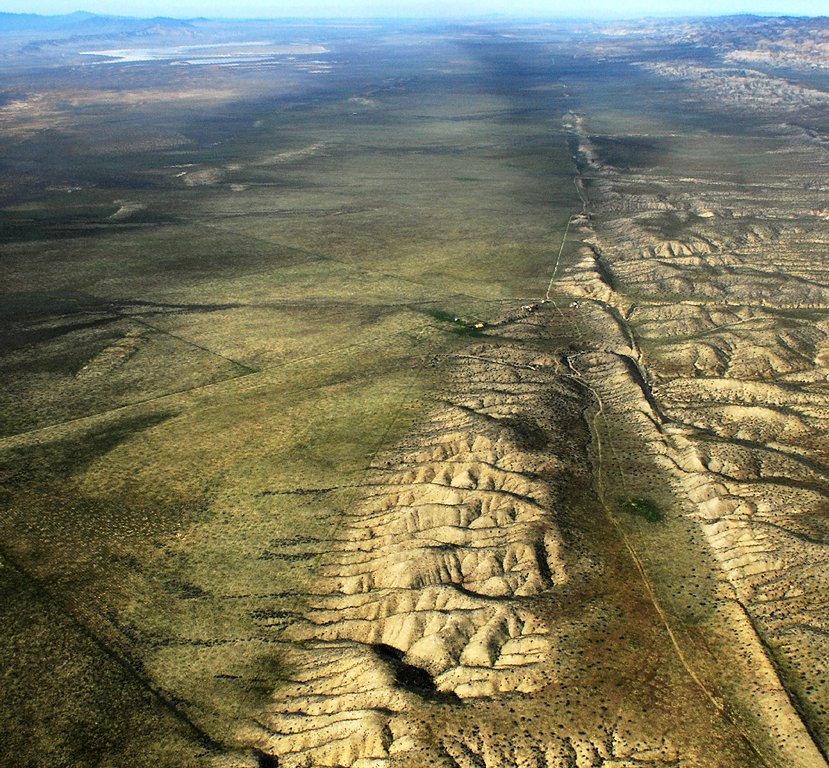

---
title:
author: "cjlortie"
date: "2018"
output:
  html_document:
    theme: flatly
    toc: no
    toc_depth: 3
    toc_float: no
  pdf_document:
    toc: no
---
##A test of camera trapping for behavioral and movement ecology
<br>

###Purpose
To explore the capacity for camera trapping techology to estimate and capture movement and behavior for vertebrate desert animals. Tested in Carrizo National Monument, California 2018.


<br>



###Data
```{r, data, warning=FALSE, message=FALSE}
library(tidyverse)
#videos
meta.data <- read_csv("data/2018_carrizo_camtrap_metadata.csv")
meta.data

vids <- read_csv("data/2018_carrizo_camtrap_videos_2.csv")
vids

vid.data <- left_join(vids, meta.data, by = "rep")
vid.data
#write_csv(vid.data, "data/test.csv")


```

###Viz
```{r, viz, warning=FALSE, message=FALSE}


```